# 🎓 E-Learning - Online Courses Platform

A feature-rich online courses platform built with **Next.js**, **ShadCN UI**, **Prisma**, **PostgreSQL**, and powerful modern tools. This project enables users to register, browse courses, watch content, and purchase courses securely, while instructors can manage their content and interact with students. It includes authentication, course videos, reviews, comments, categories, cart functionality, responsive UI, and much more. — with a clean UI, advanced animations, and full authentication.

---

## 🚀 Tech Stack

- **Frontend:** Next.js (App Router), TypeScript, Tailwind CSS, ShadCN UI, 
- **Backend:** Prisma ORM, PostgreSQL
- **Forms & Validation:** React Hook Form, Zod
- **Authentication:**
  - Email/password (JWT, bcrypt, cookies)
  - Google OAuth
  - Role-based auth (User / Instructor / Admin)
- **State Management:** Redux Toolkit + Redux Persist
- **Payments:** Stripe Integration (simulated)
- **Charts & Visualization:** recharts
- **Animations & Motion:** GSAP
- **SEO + Accessibility:** Structured metadata, semantic components, responsive design
- **UX Enhancements:** Toasts, Spinners, SEO
- **Extra UI/UX Libraries:**
  - SwiperJS (carousel for courses)
  - React Toastify
  - EmailJS (contact page)

---

## 🧩 Key Features

### 🔐 Authentication
- Register, login with form validation (`React Hook Form` + `Zod`)
- Password hashing using `bcrypt`
- JWT token-based auth (persisted in cookies)
- Google OAuth integration
- Protected routes via Edge Middleware using `jose`

### 📚 Courses
- Course categories and filtering
- Dynamic course listings with real data from PostgreSQL
- Course details page with video content and metadata
- Search for Courses
- Course reviews and comments system
- Instructor dashboard for managing courses

### 🛒 Cart & Checkout
- Add/remove courses from cart
- Dynamic checkout page
- Billing info form with validation

### 🧠 User Experience
- Responsive and accessible UI with **ShadCN** components
- Reusable `Container` layout component
- Scroll effects & parallax animations (`GSAP`)
- Loading states and fallback UIs (`ldr`, `spinner`, etc.)
- Image optimization & conversion to `.webp`
- Dynamic sliders for courses using `Swiper.js`
- Toast notifications with `react-toastify`

### 👨‍🏫 Instructor Features
- Role-based routing (user vs instructor)
- Account settings page
- Ability to become an instructor
- Course content management
- Comment moderation panel

### ⚙️ Dev & Infrastructure
- PostgreSQL + Prisma for DB and schema
- Seed data generation using `faker`
- Slugified URLs for course details
- Redux Toolkit for global state + `redux-persist`
- Google Cloud or ImageKit/Cloudinary for image and video storage
- Email integration for contact page (`emailjs`)
- SEO-friendly metadata and fallback support

---

## 🔐 Authentication Details

- **Password hashing:** `bcrypt`
- **Token generation:** `jsonwebtoken` (Node) & `jose` (Edge Runtime)
- **Secure Cookies** for token storage
- **Edge-compatible Middleware** with `jose` to authorize protected routes

---

## 🛠 Development Setup

```bash
# 1. Clone the repo
git clone https://github.com/ahmedragab15/E-Learning-Platform
cd E-Learning-Platform

# 2. Install dependencies
npm install

# Setup environment variables (.env)
# POSTGRES_URL, JWT_SECRET, GOOGLE_CLIENT_ID, GOOGLE_SECRET, etc.

# 3. Set up PostgreSQL and Prisma
npx prisma generate
npx prisma migrate dev --name init
npx prisma db push
npx prisma db seed

# 4. Start the dev server
npm run dev
```

## 🌍 Live Demo
[🔗 View Live Demo](https://ahmed-academy.vercel.app)

## 📁 Folder Structure

prisma/                           # Database schema and migrations
    ├── migrations/               # Auto-generated database migrations
        ├── 20250910210336_initial/ # First migration folder
            └── migration.sql     # SQL code for initial migration
        └── migration_lock.toml   # Lock file for migration consistency
    ├── schema.prisma             # Prisma schema definition (models, datasource, generator)
    └── seed.ts                   # Database seeding script
src/                              # Main source code
    ├── actions/                  # Server actions for handling business logic
        ├── categoryActions.ts    # Actions related to categories
        ├── commentActions.ts     # Actions related to comments
        ├── courseActions.ts      # Actions related to courses
        ├── enrollmentsActions.ts # Actions related to enrollments
        ├── instructorActions.ts  # Actions related to instructors
        ├── lessonActions.ts      # Actions related to lessons
        ├── newsActions.ts        # Actions related to news
        ├── reviewsActions.ts     # Actions related to reviews
        └── userActions.ts        # Actions related to users
    ├── app/                      # Next.js App Router pages & layouts
        ├── (auth)/               # Authentication pages
            ├── login/            # Login page
                ├── LoginForm.tsx # Login form component
                └── page.tsx      # Login page entry
            └── register/         # Registration page
                ├── page.tsx      # Register page entry
                └── RegisterForm.tsx # Register form component
        ├── (dashboards)/         # Dashboards for admin and instructors
            ├── admin/            # Admin dashboard
                ├── communication/ # Communication-related pages
                    ├── reviews/  # Manage reviews
                        ├── page.tsx
                        └── ReviewsClient.tsx
                    ├── DiscussionClient.tsx # Discussion handling
                    └── page.tsx
                ├── courses/      # Manage courses
                    ├── add-course/
                        ├── AddCourseForm.tsx # Form for adding a new course
                        └── page.tsx
                    ├── edit-course/
                        └── [slug]/ # Edit course by slug
                            ├── EditCourseForm.tsx
                            └── page.tsx
                    ├── CourseDropMenuActions.tsx # Dropdown actions for courses
                    └── page.tsx
                ├── instructors/  # Manage instructors
                    ├── [slug]/   # Instructor details page
                        └── page.tsx
                    └── page.tsx
                ├── payment/      # Payments & payouts
                    ├── payout/
                        └── page.tsx
                    └── page.tsx
                ├── students/     # Manage students
                    └── page.tsx
                ├── layout.tsx    # Admin dashboard layout
                └── page.tsx      # Admin dashboard home
            └── instructor-dashboard/ # Instructor dashboard
                ├── communication/ 
                    ├── reviews/
                        ├── page.tsx
                        └── ReviewsClient.tsx
                    ├── DiscussionClient.tsx
                    └── page.tsx
                ├── courses/
                    ├── add-course/
                        ├── AddCourseForm.tsx
                        └── page.tsx
                    ├── edit-course/
                        └── [slug]/
                            ├── EditCourseForm.tsx
                            └── page.tsx
                    └── page.tsx
                ├── students/
                    └── page.tsx
                ├── layout.tsx
                └── page.tsx
        ├── about-us/             # About us page
            ├── Counter.tsx       # Stats counter component
            └── page.tsx
        ├── account/              # User account management
            ├── settings/         # Account settings pages
                ├── change-account/
                    ├── ChangeAccountForm.tsx
                    └── page.tsx
                ├── social/
                    ├── page.tsx
                    └── SocialSettingsForm.tsx
                ├── layout.tsx
                ├── page.tsx
                ├── ProfileSettingsForm.tsx
                └── SettingsSidebar.tsx
            ├── AccountAside.tsx
            ├── layout.tsx
            └── page.tsx
        ├── all-courses/          # All courses listing
            ├── [slug]/           # Course details
                ├── videos/       # Lessons/videos of the course
                    ├── [lessonSlug]/ 
                        └── page.tsx
                    ├── ContentArea.tsx
                    ├── CourseComments.tsx
                    ├── page.tsx
                    ├── Sidebar.tsx
                    └── VideoPlayer.tsx
                ├── CourseReviews.tsx
                └── page.tsx
            ├── CoursesFilter.tsx
            └── page.tsx
        ├── api/                  # API routes
            ├── auth/
                └── google/       # Google OAuth routes
                    ├── callback/
                        └── route.ts
                    └── login/
                        └── route.ts
            ├── courses/
                └── search/
                    └── route.ts
            └── user/
                └── route.ts
        ├── cart/                 # Shopping cart
            ├── CartItem.tsx
            ├── CartItems.tsx
            └── page.tsx
        ├── checkout/             # Checkout and payment
            ├── OrderSummary.tsx
            ├── page.tsx
            └── PaymentForm.tsx
        ├── contact-us/           # Contact page
            ├── ContactUsForm.tsx
            └── page.tsx
        ├── courses-category/     # Course categories page
            └── page.tsx
        ├── home/                 # Homepage
            └── page.tsx
        ├── instructors/          # Instructors pages
            ├── [slug]/
                └── page.tsx
            └── page.tsx
        ├── error.tsx             # Global error page
        ├── favicon.ico           # App favicon
        ├── globals.css           # Global styles
        ├── layout.tsx            # Root layout
        ├── loading.tsx           # Loading state UI
        ├── manifest.ts           # PWA manifest
        ├── not-found.tsx         # 404 page
        ├── page.tsx              # Landing page
        └── StoreProvider.tsx     # Redux store provider
    ├── components/               # Shared React components
        ├── admin-dashboard/      # Admin dashboard components
            ├── AdminSidebar.tsx
            ├── AdminTransactionTable.tsx
            ├── EarningsChart.tsx
            ├── MetricCard.tsx
            ├── MobileSidebar.tsx
            └── StudentMonitoring.tsx
        ├── cards/                # Reusable cards components
            ├── CategoryCard.tsx
            ├── CourseCard.tsx
            ├── InstructorCard.tsx
            ├── NewsCard.tsx
            ├── ProgressCourseCard.tsx
            ├── ReviewCard.tsx
            └── SocialCard.tsx
        ├── home/                 # Homepage sections & components
            ├── AllNews.tsx
            ├── CoursesCategoriesSection.tsx
            ├── CoursesSection.tsx
            ├── HeroUser.tsx
            ├── HeroVisitor.tsx
            ├── NewsSection.tsx
            ├── ReviewsSection.tsx
            ├── UserHome.tsx
            ├── VisitorHome.tsx
            └── WhyUs.tsx
        ├── instructor-dashboard/ # Instructor dashboard components
            ├── EarningChart.tsx
            ├── InstructorSidebar.tsx
            ├── StatsCard.tsx
            └── TransactionTable.tsx
        ├── layout/               # Layout components
            ├── Footer.tsx
            └── Header.tsx
        ├── shared/               # Shared UI elements
            ├── ActiveLink.tsx
            ├── AddToCartButton.tsx
            ├── ArrowNavigation.tsx
            ├── Container.tsx
            ├── Heading.tsx
            ├── Icons.ts
            ├── Images.ts
            ├── PaginationComponent.tsx
            ├── RatingProgress.tsx
            ├── SelectMenu.tsx
            └── StarsRating.tsx
        ├── skeletons/            # Loading skeletons
            ├── CoursesCategoriesSkeleton.tsx
            ├── CoursesSkeleton.tsx
            ├── NewsSkeleton.tsx
            └── ReviewsSkeleton.tsx
        ├── ui/                   # UI primitives (ShadCN/UI)
        ├── Banner.tsx
        ├── Courses.tsx
        ├── CoursesCategories.tsx
        ├── index.ts
        ├── LessonsAccordion.tsx
        ├── modeToggle.tsx
        ├── Reviews.tsx
        ├── ScrollToTop.tsx
        └── themeProvider.tsx
    ├── constants/                # Static constants
        └── index.ts
    ├── lib/                      # Utility functions and libraries
        ├── db.ts                 # Database connection
        ├── JWT.ts                # JWT utilities
        ├── slugify.ts            # Slug generator
        └── utils.ts              # General utilities
    ├── redux/                    # Redux state management
        ├── features/             # Redux slices
            └── cart/
                └── cartSlice.ts  # Cart slice
        ├── hooks.ts              # Custom Redux hooks
        └── store.ts              # Redux store setup
    ├── schema/                   # Validation schemas (Yup/Zod)
        ├── AccountSettingsSchema.ts
        ├── BillingInfoSchema.ts
        ├── ContactUsSchema.ts
        ├── loginSchema.ts
        └── registerSchema.ts
    ├── swiper/                   # Swiper components
        └── SwiperSlider.tsx
    ├── types/                    # TypeScript definitions
        ├── index.d.ts
        └── next-pwa.d.ts
    └── middleware.ts             # Next.js middleware (auth, Protect Routes, etc.)


## 📸 Screenshots

  #### Visitor Home Page
   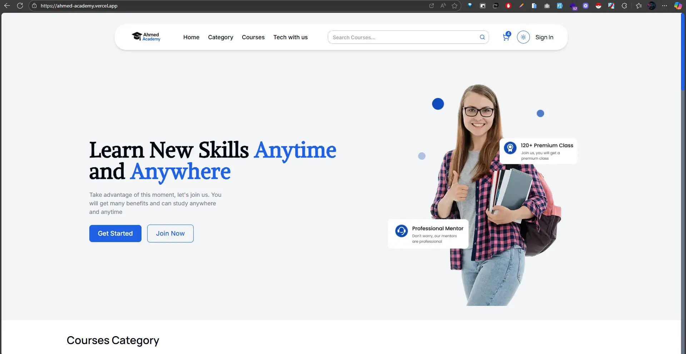
  <br /> 

   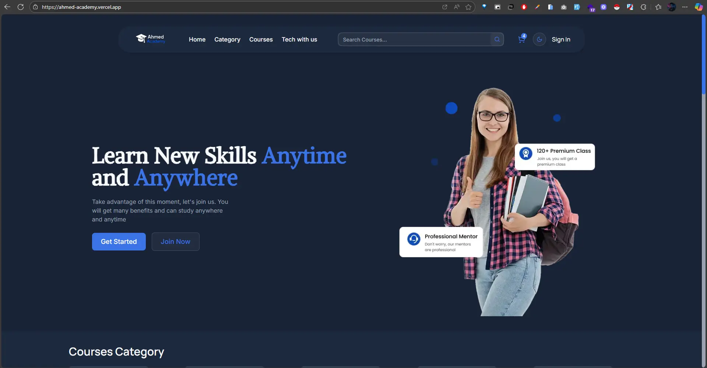
  <br /> 

  #### Categories
   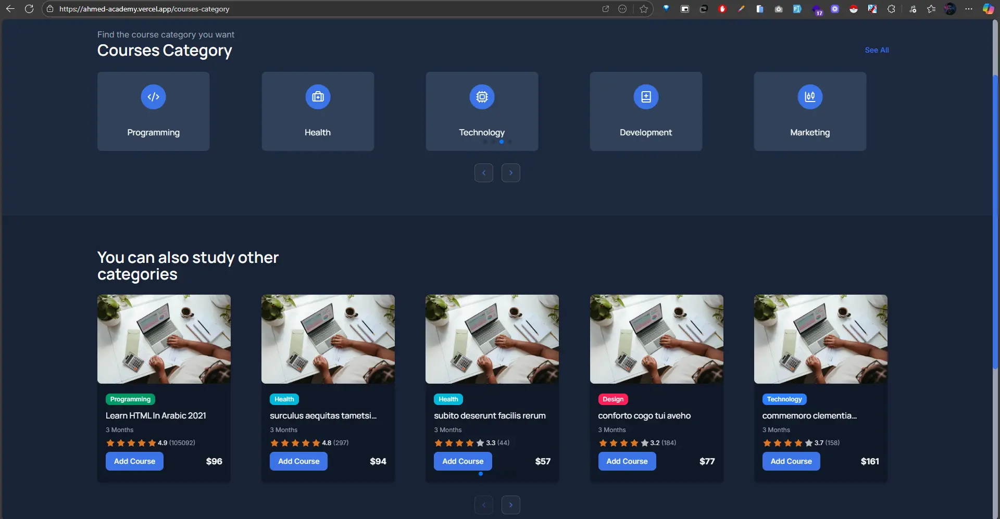
  <br /> 

  #### Courses
   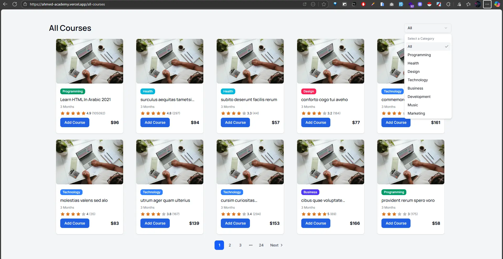
  <br /> 

  #### Instructors
   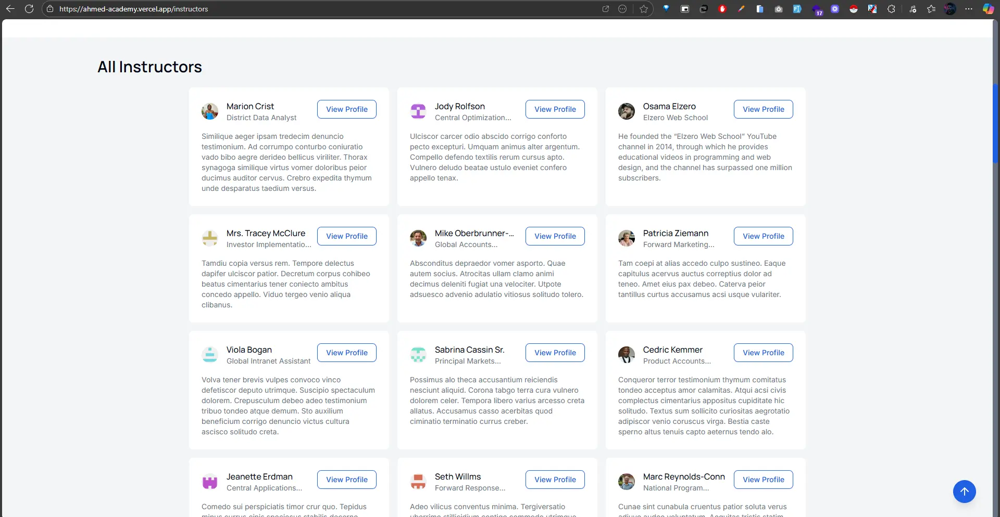
  <br /> 

  #### Instructor Profile
   
  <br /> 

  #### Course Details
   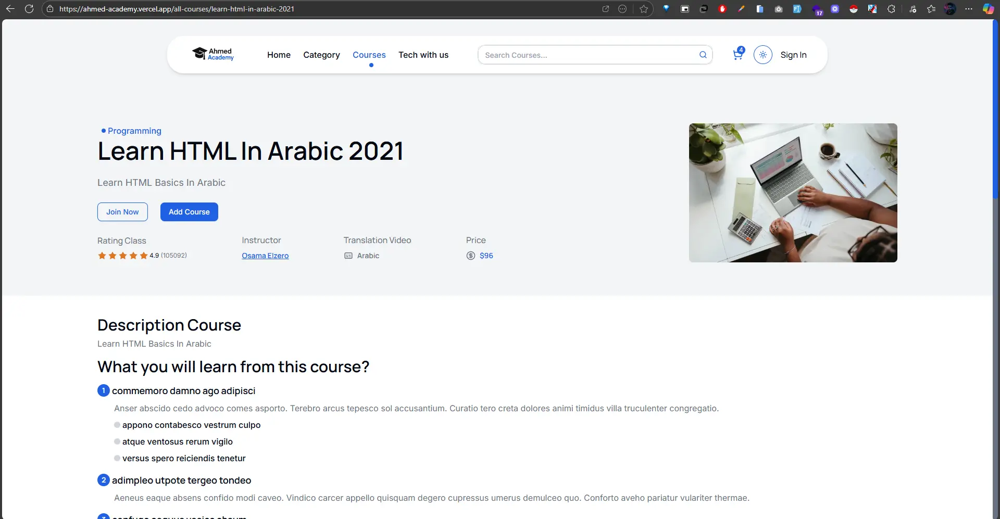
  <br /> 

  #### Course & Instructor Reviews
   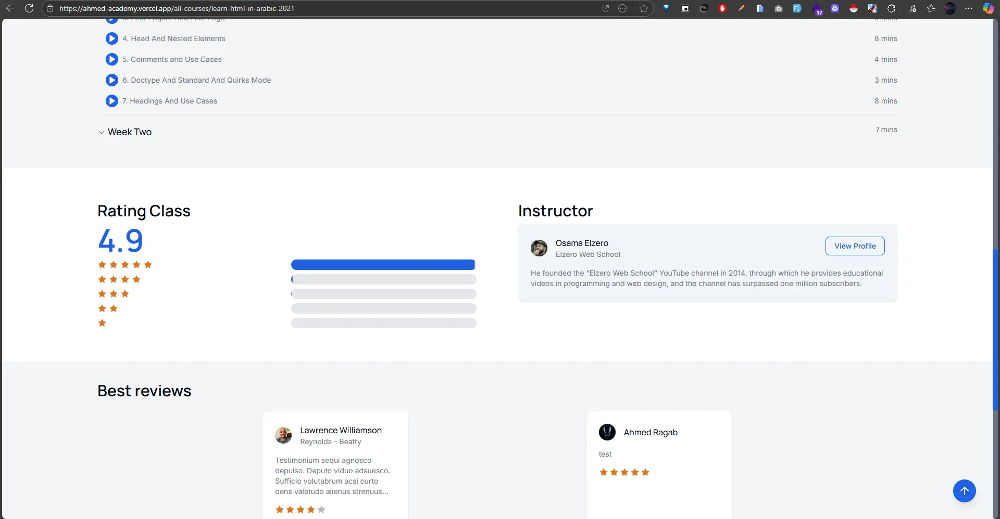
  <br /> 

  #### Cart
   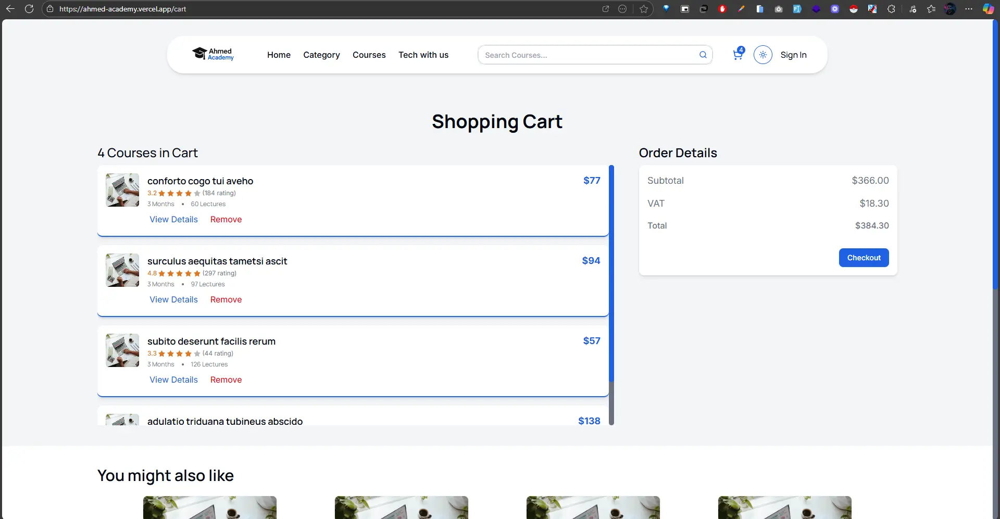
  <br /> 

  #### Checkout
   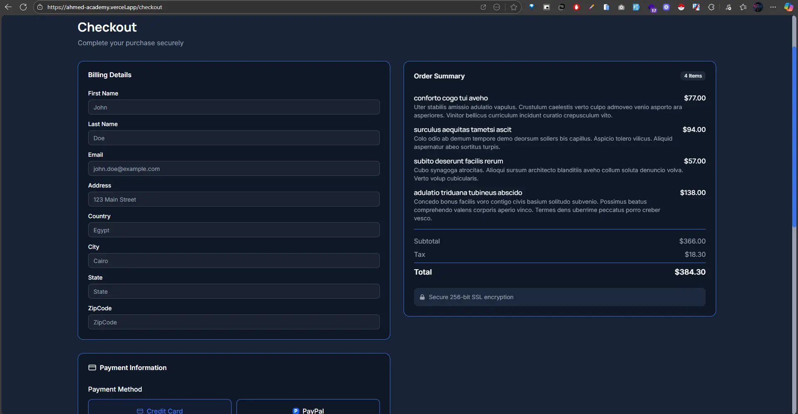
  <br /> 

  #### Sign Up
   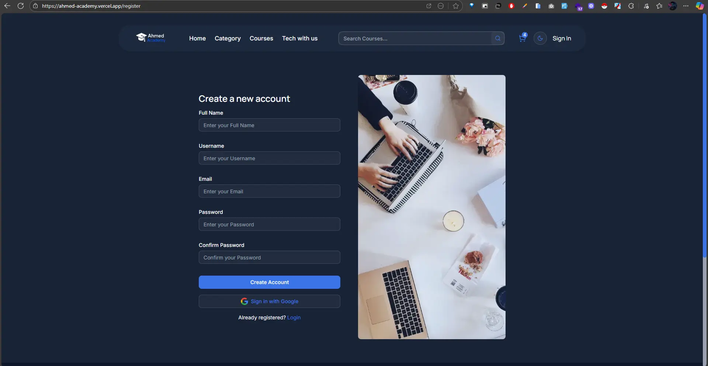
  <br /> 

  #### About us Stats 
   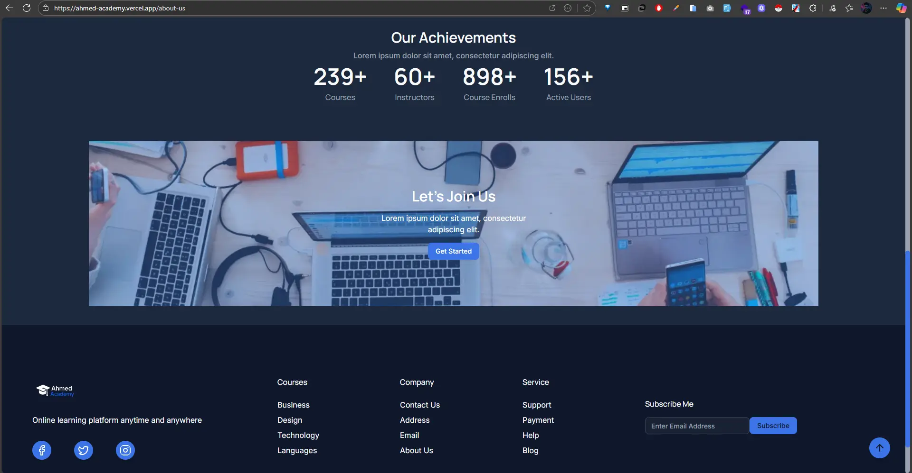
  <br /> 

  #### Course Videos
   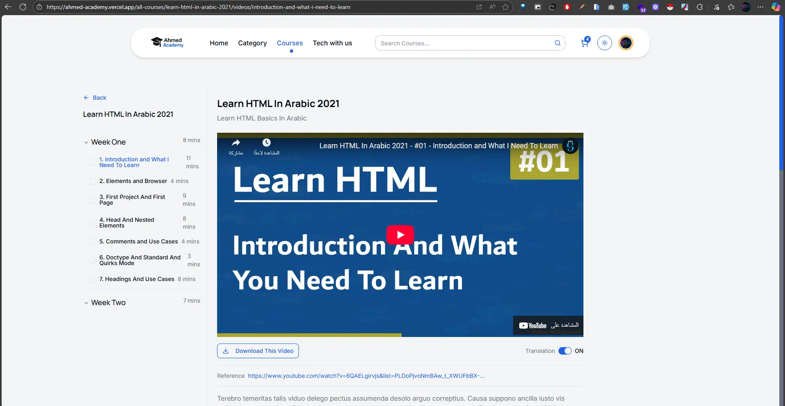
  <br /> 

  #### Course Comments
   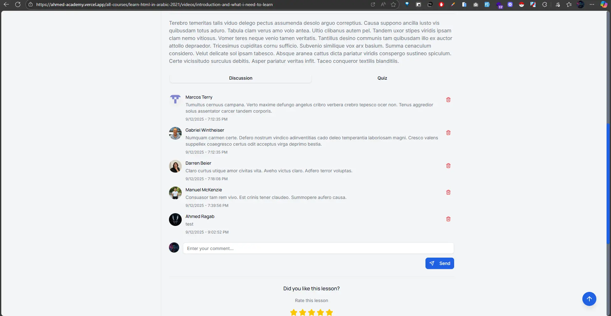
  <br /> 

  #### Home Page after Login
   
  <br /> 

  #### User Profile
   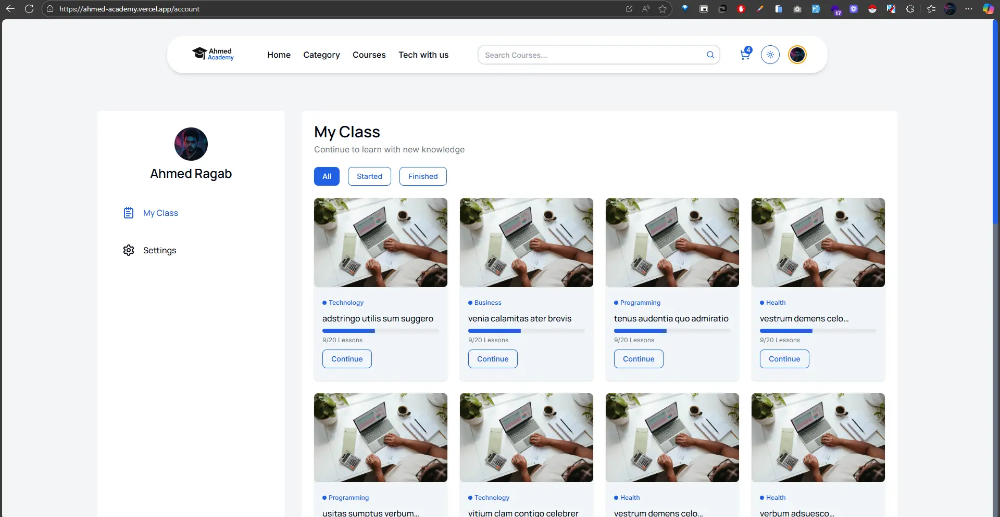
  <br /> 

  #### Admin Dashboard
   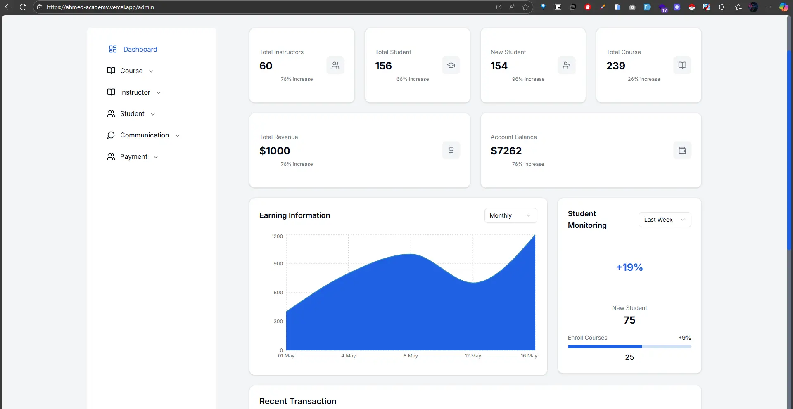
  <br /> 

  #### Admin Courses Control
   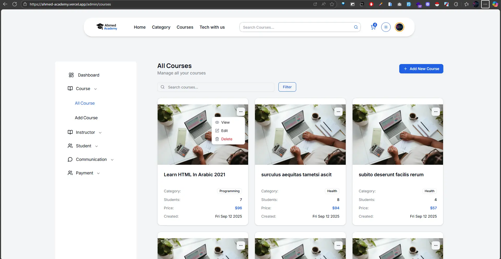
  <br /> 

  #### Instructors Info
   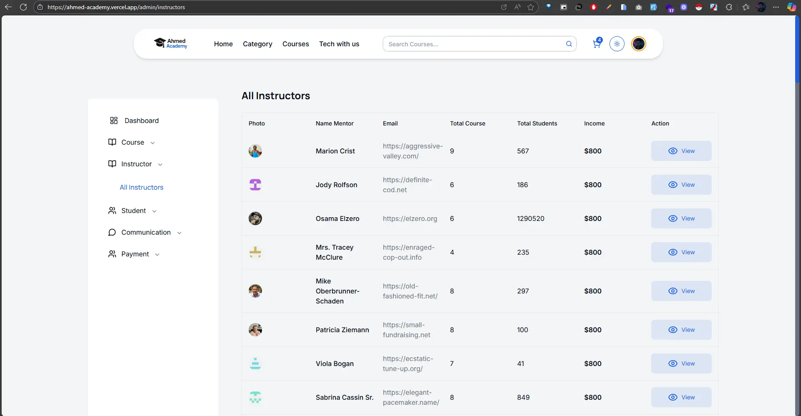
  <br /> 

  #### Manage All Reviews & Comments 
   
  <br /> 

  #### Instructor Dashboard
   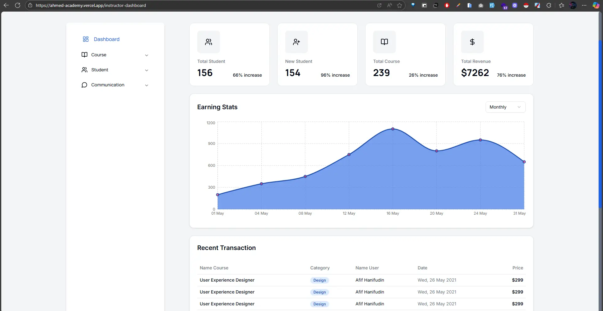
